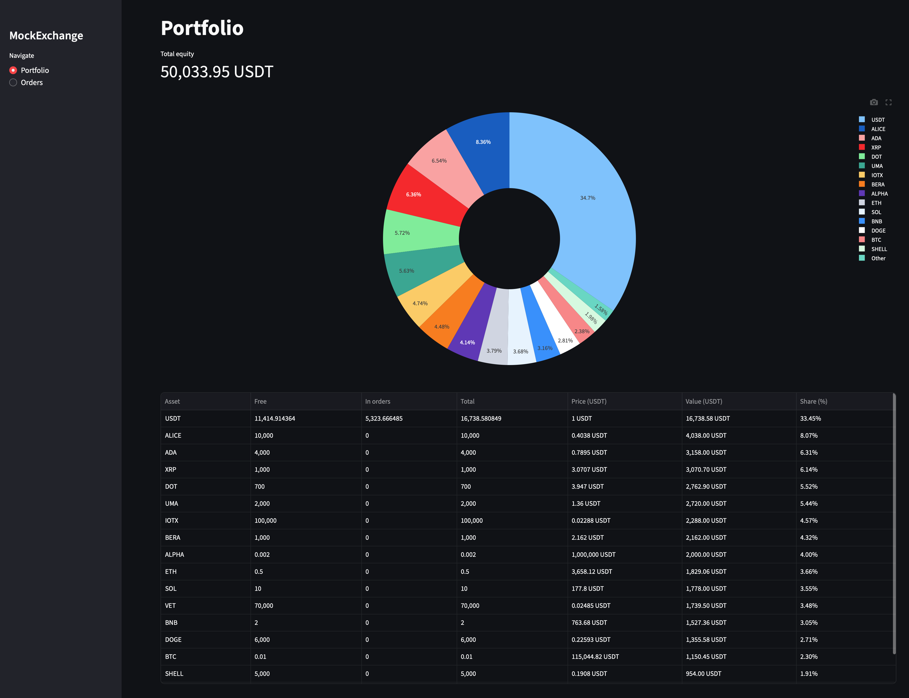
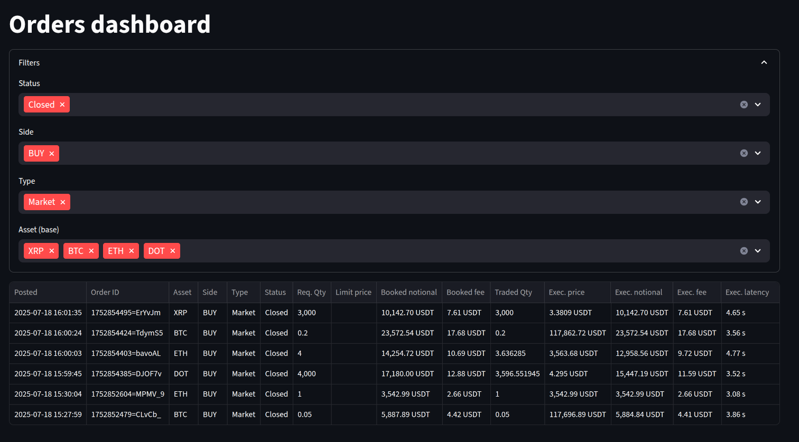

# MockExchange Deck  
*Streamlit front-end for the MockExchange paper-trading platform*

> **Heads-up:** this repository only contains the **front-end**.  
> The app needs the matching back-end running locally or remotely:  
> <https://github.com/didac-crst/mockexchange-api>

---

## ✨ Features  

*   Real-time **portfolio dashboard** with equity value, asset allocation pie and P & L.  
*   **Orders** table with status, execution price, fees and latency.  
*   Automatic refresh every *REFRESH_SECONDS* (default 60 s).  
*   Clean Streamlit UI that works on desktop and mobile.  
*   One-click Docker deployment.

---

## 🖼️ UI Screenshots 





---

## 🚀 Quick start (local)

```bash
# 1 · clone & enter
git clone https://github.com/didac-crst/mockexchange-deck.git
cd mockexchange-deck

# 2 · create a Python 3.12 env  (skip if you use Docker)
python -m venv .venv && source .venv/bin/activate

# 3 · install deps
pip install --upgrade pip
pip install poetry
poetry install --no-root

# 4 · copy & edit environment
cp .env.example .env
#   └─ adjust API_URL, API_KEY, … to point to your running back-end

# 5 · run
streamlit run app/main.py
```

The UI will be available at <http://localhost:8501>.

---

## 🐳 Quick start (Docker / docker-compose)

```bash
git clone https://github.com/didac-crst/mockexchange-deck.git
cd mockexchange-deck
cp .env.example .env                # set correct API_URL, API_KEY …
sh start_mockexchange.sh            # or: docker compose up -d
```

> The container uses **host network mode** so it can reach the back-end on  
> `localhost:8000` by default. Adjust `.env` if your API runs elsewhere.

---

## 🛠️ Configuration  

| Variable        | Default           | Purpose                                          |
|-----------------|-------------------|--------------------------------------------------|
| `API_URL`       | `http://localhost:8000` | Base URL of the MockExchange API server |
| `API_KEY`       | `dev-key`         | Bearer key sent as `x-api-key` header            |
| `REFRESH_SECONDS` | `60`            | UI auto-refresh interval (seconds)               |
| `QUOTE_ASSET`   | `USDT`            | Fiat or stablecoin used to value the portfolio   |

All variables live in **`.env`** (see `.env.example`).  
They are loaded via *python-dotenv* inside `app/config.py`.

---

## Repo layout (updated 2025-07)  

```text
mockexchange_deck/
├── Dockerfile                   ← Streamlit + Poetry export 
├── docker-compose.yml           ← Convenience wrapper (host‑network)
├── README.md                    ← You’re here
├── pyproject.toml               ← Poetry deps & build meta
├── start_mockexchange.sh        ← Quick dev helper
├── stop_mockexchange.sh
├── app/                         # Streamlit source code
│   ├── __init__.py              
│   ├── main.py                  # Entry‑point with sidebar navigation
│   ├── config.py                # dotenv config accessor
│   ├── services/                # API adapter layer
│   │   ├── __init__.py
│   │   ├── api.py
│   │   └── model.py
│   └── _pages/                  # Individual Streamlit pages
│       ├── __init__.py
│       ├── _helpers.py
│       ├── orders.py
│       └── portfolio.py
├── docs/                        # Screenshots, diagrams, extra docs
└── LICENSE
```

---

## 🧑‍💻 Development tips  

*   Hot-reload is handled by Streamlit; just save your code.  
*   **Add pages** by creating new modules under `app/_pages/` and a radio  
    button in the sidebar (`app/main.py`).  
*   Keep *all* network requests inside `app/services/api.py` so pages stay  
    UI-only.

---

## 🙏 Acknowledgements  

*   Built with **Streamlit**, **Plotly Express** and **Poetry**.  
*   Inspired by Binance’s web dashboard, but 100 % mock / paper-trading.

---  

## License 🪪  

This project is released under the MIT License — see [`LICENSE`](LICENSE) for details.  

> **Don’t risk real money.**  Spin up MockExchange, hammer it with tests, then hit the real markets only when your algos are solid.