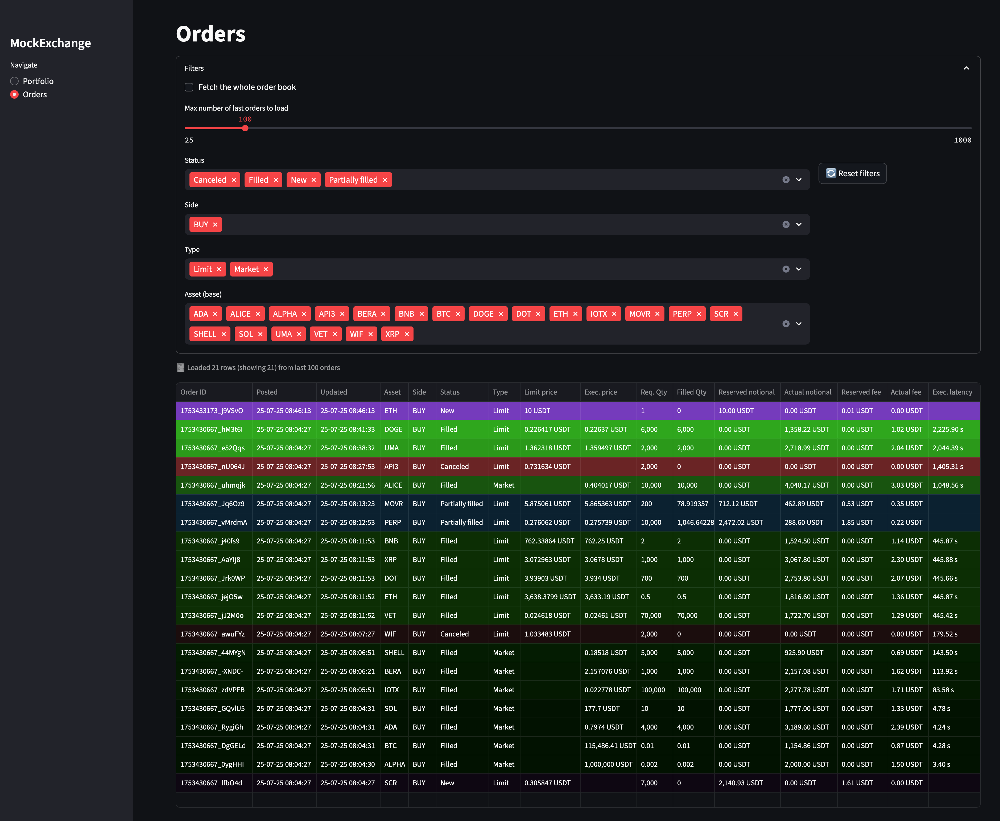

# MockExchange Deck  
*Streamlit front-end for the MockExchange paper-trading platform*

> **Heads-up:** this repository only contains the **front-end**.  
> The app requires a matching back-end — [**mockexchange-api**](https://github.com/didac-crst/mockexchange-api) — running locally or remotely.

---

## ✨ Features  

*   Real-time **portfolio dashboard** with equity value and asset allocation pie.  
*   **Orders** table with status, execution price, fees and latency.  
*   Automatic refresh every *REFRESH_SECONDS* (default 60 s).  
*   Clean Streamlit UI that works on desktop and mobile.  
*   One-click Docker deployment.

---

## 🖼️ UI Screenshots 




---

## 🚀 Quick start (local)

```bash
# 1 · clone & enter
git clone https://github.com/didac-crst/mockexchange-deck.git
cd mockexchange-deck

# 2 · create a Python 3.12 env  (skip if you use Docker)
python -m venv .venv && source .venv/bin/activate

# 3 · install deps
pip install --upgrade pip
pip install poetry
poetry install --no-root

# 4 · copy & edit environment
cp .env.example .env
#   └─ adjust API_URL, API_KEY, … to point to your running back-end

# 5 · run
streamlit run app/main.py
```

The UI will be available at <http://localhost:8501>.

---

## 🐳 Quick start (Docker / docker-compose)

```bash
git clone https://github.com/didac-crst/mockexchange-deck.git
cd mockexchange-deck
cp .env.example .env                # set correct API_URL, API_KEY …
sh start_mockexchange.sh            # or: docker compose up -d
```

> The container uses **host network mode** so it can reach the back-end on  
> `localhost:8000` by default. Adjust `.env` if your API runs elsewhere.

---

## 🛠️ Configuration

| Variable               | Default                       | Purpose                                                     |
|------------------------|-------------------------------|-------------------------------------------------------------|
| `API_URL`              | `http://localhost:8000`       | Base URL of the MockExchange API server                     |
| `UI_URL`                | `http://mockexchange.your-domain.com` | Base URL used to generate links in the frontend    |
| `APP_TITLE`             | `MockExchange`                  | Title shown in the Streamlit browser tab and header      |
| `LOGO_FILE`             | `logo.png`                      | Name of the logo image to display in the sidebar         |
| `API_KEY`              | `dev-key`                     | Bearer key sent as `x-api-key` header                       |
| `REFRESH_SECONDS`      | `60`                          | UI auto-refresh interval (seconds)                          |
| `QUOTE_ASSET`          | `USDT`                        | Fiat or stablecoin used to value the portfolio              |
| `FRESH_WINDOW_S`       | `60`                          | Time-window (seconds) for “fresh” row highlighting          |
| `N_VISUAL_DEGRADATIONS`| `60`                          | Number of fade-out levels for row highlighting              |
| `SLIDER_MIN`           | `25`                          | Minimum “tail” slider value (earliest orders to fetch)      |
| `SLIDER_MAX`           | `1000`                        | Maximum “tail” slider value                                 |
| `SLIDER_STEP`          | `25`                          | Step size for the “tail” slider                             |
| `SLIDER_DEFAULT`       | `100`                         | Default “tail” slider value                                 |

All variables live in **`.env`** (see `.env.example`).  
They are loaded via *python-dotenv* inside `app/config.py`.

### 🎨 Sidebar customization

You can customize the sidebar’s appearance using two environment variables:

| Variable     | Behavior                                                                 |
|--------------|--------------------------------------------------------------------------|
| `APP_TITLE`  | Optional title shown at the **top of the sidebar**. If unset or empty, no title is shown. |
| `LOGO_FILE`  | Filename of a logo image (e.g. `logo.png`) shown **above the sidebar title**. If unset, no image is shown. If set, the file **must exist** in the `misc/` folder at the **repo root**. |

#### ⚠️ Important:
- Create a `misc/` directory at the top level of the repo if it doesn’t exist:
    ```bash
    mkdir misc
    ```
- Save your logo image there, e.g. `misc/logo.png`.
- Reference it in `.env` like so:
    ```
    LOGO_FILE=logo.png
    ```
- If `LOGO_FILE` is set but the file is missing or unreadable, an error will occur at runtime.

---

## Repo layout (updated 2025-07)  

```text
mockexchange_deck/
├── Dockerfile                   ← Streamlit + Poetry export 
├── docker-compose.yml           ← Convenience wrapper (host‑network)
├── README.md                    ← You’re here
├── pyproject.toml               ← Poetry deps & build meta
├── start_mockexchange.sh        ← Quick dev helper
├── stop_mockexchange.sh
├── app/                         # Streamlit source code
│   ├── __init__.py              
│   ├── main.py                  # Entry‑point with sidebar navigation
│   ├── config.py                # dotenv config accessor
│   ├── services/                # API adapter layer
│   │   ├── __init__.py
│   │   ├── api.py
│   │   └── model.py
│   └── _pages/                  # Individual Streamlit pages
│       ├── __init__.py
│       ├── _helpers.py
│       ├── orders.py
│       └── portfolio.py
├── docs/                        # Screenshots, diagrams, extra docs
├── misc/                        ← !!! Folder to be created !!!
└── LICENSE
```

---

## 🧑‍💻 Development tips  

*   Hot-reload is handled by Streamlit; just save your code.  
*   **Add pages** by creating new modules under `app/_pages/` and a radio  
    button in the sidebar (`app/main.py`).  
*   Keep *all* network requests inside `app/services/api.py` so pages stay  
    UI-only.

---

## 🙏 Acknowledgements  

*   Built with **Streamlit**, **Plotly Express** and **Poetry**.  
*   Inspired by Binance’s web dashboard, but 100 % mock / paper-trading.

---  

## License 🪪  

This project is released under the MIT License — see [`LICENSE`](LICENSE) for details.  

> **Don’t risk real money.**  Spin up MockExchange, hammer it with tests, then hit the real markets only when your algos are solid.